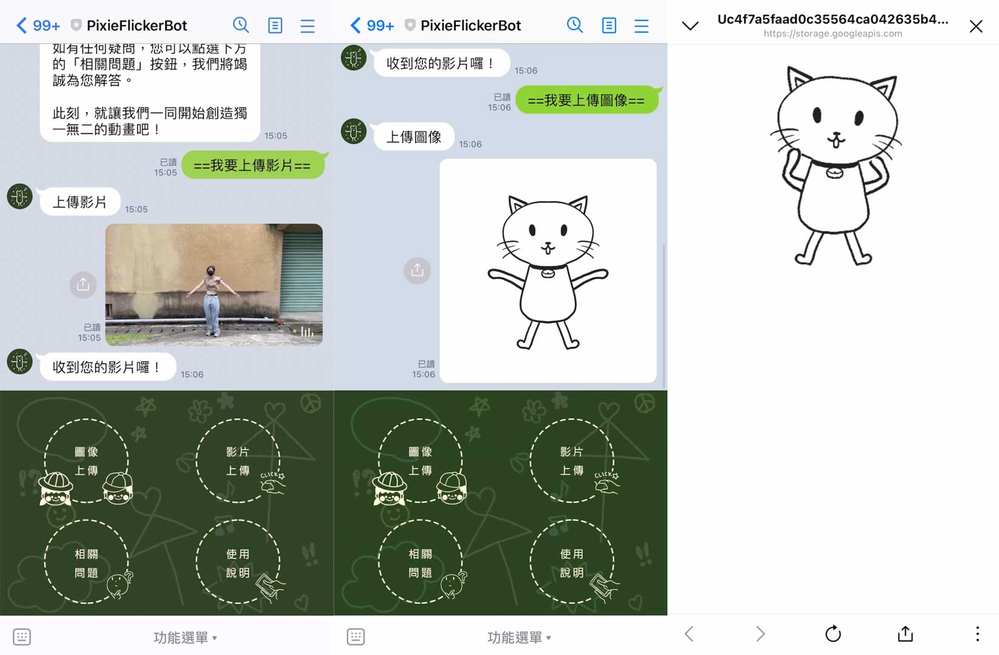

# tibame2DtoBVH

## 0807_conda_videotobvh.ipynb
This code is a modified version of Dene33's video_to_bvh. It utilizes Miniconda to isolate environments between models. Partial code modifications have been made to enable analysis of videos with non-numeric filenames, along with resolving duplicate definition issues. Additionally, the version of opendr has been upgraded to 0.78.

## 0812_vm_videotobvh.ipynb
This code is an adaptation of the above Colab version to suit VM environments. It includes the integration of facebookresearch/AnimatedDrawings.

The modified code for the aforementioned models is located within the same group member's repository at mxmx1116/tibame.

## Watch the Line Bot demo in action

[Line Bot Demo](https://drive.google.com/file/d/14A3ieo-yQx_Q3-hXcvy49Ayww9aawEfz/view?usp=drive_link)

This video showcases the key features of our Line Bot, When users upload motion videos and character images, we perform pose recognition on the videos and bind their actions to the character images, bringing the character images to life.

## References
- Original video_to_bvh repository: [Dene33/video_to_bvh](https://github.com/Dene33/video_to_bvh)
- Facebook AnimatedDrawings repository: [facebookresearch/AnimatedDrawings](https://github.com/facebookresearch/AnimatedDrawings)
- Group member's repository: [mxmx1116/tibame](https://github.com/mxmx1116/tibame)
